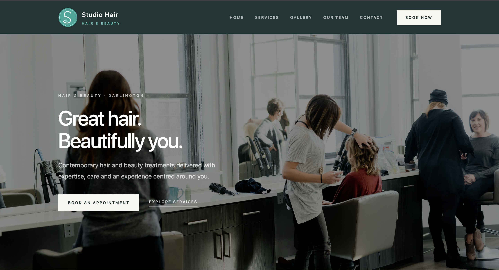
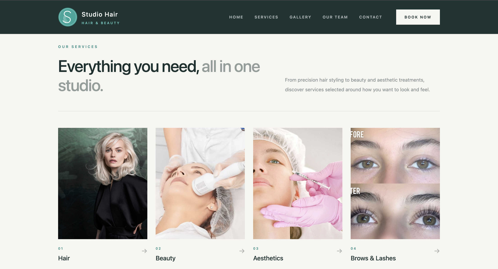

# salon-rebuild

A fictional contemporary salon website built as a portfolio and retrospective design exercise.

The project revisits the type of salon website work I produced early in my freelance career and explores how I would approach the same broad category today using a more considered UI/UX and engineering process.

## Scope

This is not a commissioned redesign and is not affiliated with Helen's Hair or any other salon business.

The content, team profiles, prices, contact details and service descriptions in this repository are fictional or illustrative. No current client copy, staff information, testimonials, pricing, photographs or private business information has been reused from Helen's Hair.

## Current pages

- Home
- Services
- Team
- Gallery
- Contact / demo booking enquiry

## Stack

- Go
- `html/template`
- Tailwind CSS
- Server-rendered HTML

## Purpose

The goal is to demonstrate the difference between an early freelance salon project and the kind of visual system, content hierarchy, responsive design and frontend implementation I would produce now.

## License

Current versions of this project are © 2026 Daniel J. Manning. All rights reserved.

This repository is public for portfolio and educational viewing only.
No permission is granted to copy, modify, redistribute, publish, sublicense,
sell, or use the project or its design without prior written permission.

Earlier versions of this repository were released under the MIT License.
Those versions remain subject to the licence terms under which they were
originally published.
